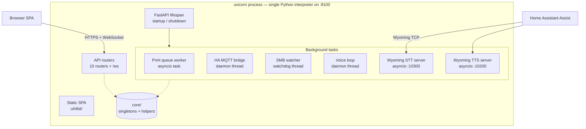
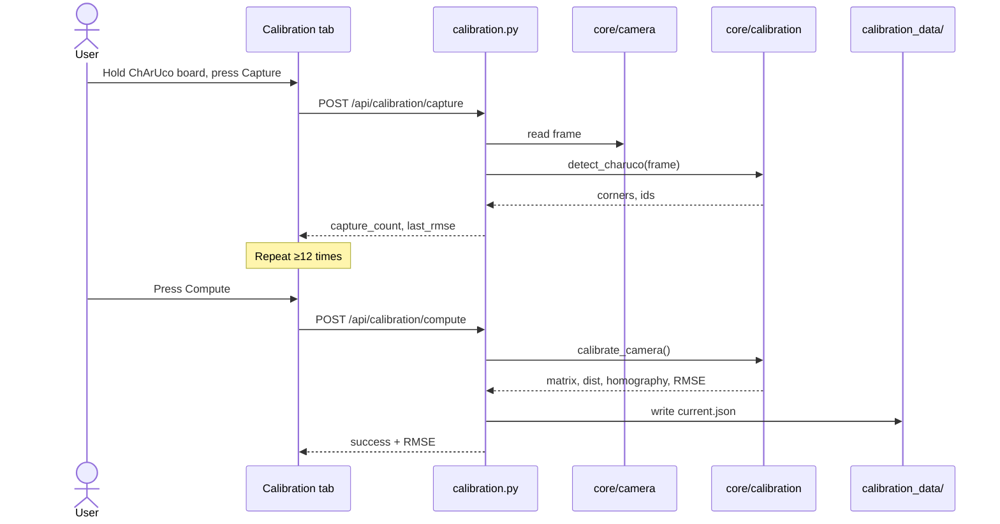
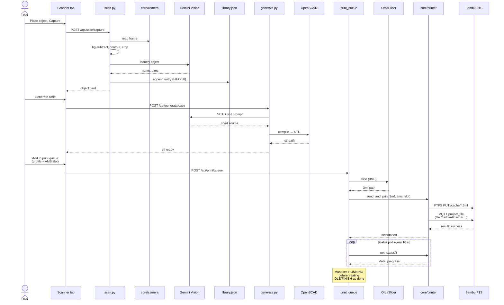
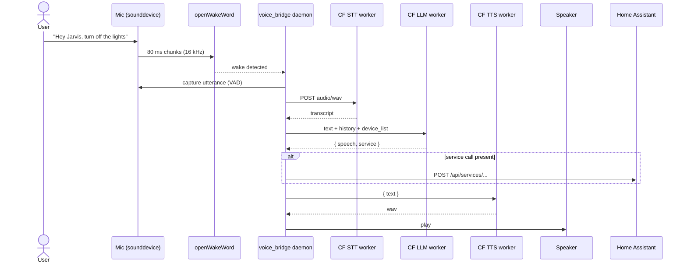

# Holomat — Architecture

This is the engineer's-eye view: how the modules fit together, who owns which
piece of state, where the concurrency hazards are, and why specific design
calls were made. If you're new to the repo, read this **after** the
[README](README.md).

---

## 1. Topology



All HTTP, WebSocket, slicing dispatch, queue management, and the two Wyoming
TCP servers share **one** asyncio event loop. Long-running CPU/IO (OpenSCAD
compile, OrcaSlicer slice, FTPS upload) is offloaded to the default thread
pool executor via `loop.run_in_executor`.

Three things run **outside** that loop because they need their own blocking
control flow:

| Thread                  | Why it's its own thread                                     |
|---|---|
| HA MQTT bridge          | paho-mqtt's `loop_start()` wants a dedicated worker thread. |
| Voice wake-word loop    | openWakeWord + `sounddevice` callbacks block on audio I/O.  |
| SMB watcher             | `watchdog.Observer` runs its own inotify/poll thread.       |

---

## 2. Process model & concurrency

### Singletons & locks

| Resource          | Owner                  | Concurrency guard           | Notes |
|---|---|---|---|
| USB camera        | `core/camera.py`       | `threading.Lock`            | One open device handle; the MJPEG stream and scan capture share it. |
| Object library    | `core/scanner.py`      | `threading.Lock`            | Read-modify-write around `scan_data/library.json`. Max 50 entries, FIFO with pin protection. |
| Calibration       | `core/calibration.py`  | `asyncio.Lock`              | Capture set + intrinsics; persisted to `calibration_data/current.json`. |
| Printer MQTT      | `core/printer.py`      | `threading.Lock`            | Serialises status polls vs. `project_file` triggers — the P1S broker drops the trigger if a status connection is held concurrently. |
| Print queue jobs  | `core/print_queue.py`  | `asyncio.Lock`              | Job state mutations + `print_queue.json` writes. |
| Voice history     | `core/voice_bridge.py` | (none — display-only)       | Daemon-thread writes, HTTP-handler reads. Tracked as L21. |

### Why the printer MQTT lock matters

The P1S MQTT broker is single-client-friendly: if a status poll holds an
open connection when the `project_file` trigger publishes on a second
connection, the printer ACKs `result: "success"` but never starts the job.
Symptom: "FTP upload OK, no print". The lock in
[`core/printer.py`](core/printer.py) makes all printer-MQTT operations
mutually exclusive process-wide. Fixed in commit `dfd4fd8`.

---

## 3. Module map

### `core/`

| File              | Responsibility |
|---|---|
| `camera.py`       | OpenCV `VideoCapture` singleton (1280×720 @ 15 FPS), threading lock, MJPEG frame source. |
| `calibration.py`  | ChArUco board detection (7×5, 40 mm squares), camera matrix + homography, ≥12 captures, RMSE < 1.0 px target. |
| `scanner.py`      | Background subtract → contour → crop → Gemini Vision → library write. |
| `slicer.py`       | OrcaSlicer CLI wrapper (`slice_model`) + OpenSCAD compiler (`compile_openscad`); 120 s timeout, manifold backend. |
| `printer.py`      | Bambu LAN dispatch — FTPS upload + MQTT trigger + cloud-auth-for-user_id helpers + typed `PrinterAuthError`. |
| `print_queue.py`  | Job FSM `queued → slicing → uploading → printing → done/failed/cancelled`; status-poll loop with "must see RUNNING" guard. |
| `voice_bridge.py` | Wyoming STT/TTS servers + wake-word daemon thread; Cloudflare worker pipeline; HA service-call dispatch. |
| `ha_bridge.py`    | MQTT discovery — publishes Holomat state to Mosquitto so HA auto-creates entities. |
| `smb_watcher.py`  | Inotify-style watch on `smb_share/`; HEIC→JPEG; upload to Cloudflare R2 via the gallery worker. |
| `logger.py`       | Logging façade; broadcasts log records over the `/ws` WebSocket to the in-UI console. |
| `version.py`      | `VERSION = "1.0.0"` — single source of truth. |

### `api/routes/`

One router per feature, mounted in `main.py`. Endpoints listed at
[CONFIG.md § API reference](CONFIG.md) (or run the server and open
`/docs` for the live OpenAPI spec). Highlights:

| Router              | Surface                                                              |
|---|---|
| `system.py`         | `/api/health`, `/api/status` — boot checklist + version. |
| `camera.py`         | `/api/camera/status`, `/api/camera/stream` (MJPEG). |
| `calibration.py`    | capture / compute / reset of the ChArUco calibration. |
| `scan.py`           | background, capture, library CRUD, `/generate-case`. |
| `print.py`          | STL list, queue CRUD, profile CRUD, printer status. |
| `gallery.py`        | R2 image list, fetch, delete, Meshy 3D generation. |
| `generate.py`       | OpenSCAD generation + compile, Meshy 3D dispatch. |
| `ha.py`             | HA state passthrough + manual push. |
| `voice.py`          | Voice bridge status, conversation history, manual trigger. |
| `settings.py`       | `.env` read/write, restart, per-integration connection tests, Bambu OTP auth. |

The WebSocket router (`api/websocket.py`) hosts a single `/ws` endpoint used
by the in-UI Console and by `print_queue` to push job-state changes.

### `ui/src/`

| Area              | Files | What they do |
|---|---|---|
| `pages/`          | Dashboard, Calibration, Scanner, Print, Gallery, HomeAssistant, Voice, Settings | One per top-nav tab. |
| `hooks/`          | `useWebSocket`, `useHealth`, `useScanner`, `usePrint`, `useCalibration` | Polling + state + API plumbing. |
| `components/`     | `Console`, `Layout`, `BootChecklist`, `RadarAnimation`, `StatusPill`, `OnScreenKeyboard` | Cross-page widgets. |
| `api/client.ts`   | All `fetch` calls + TypeScript types for API responses. |

---

## 4. Data flow

### 4a. Calibration



### 4b. Scan → case → print



### 4c. Voice — "Hey Jarvis, …"



Wyoming STT/TTS TCP servers (`:10300` / `:10200`) handle the **other**
direction: HA's Assist pipeline dials *into* Holomat so HA's wake-word
detection can drive Holomat's microphone-less STT/TTS surface.

---

## 5. Persistence

| Path                              | Contents | Format | Notes |
|---|---|---|---|
| `scan_data/library.json`          | Identified object library | JSON array | Max 50 entries, FIFO eviction with pin protection. Threading lock. |
| `scan_data/background.npy`        | Empty-mat reference frame | NumPy | mtime indicates staleness. |
| `scan_data/print_queue.json`      | Job queue (all states) | JSON array | Mid-flight states reset to `queued` on restart. |
| `scan_data/print_profiles.json`   | User-defined print profiles | JSON array | Built-ins (draft / standard / fine) are code, not file. |
| `scan_data/3mfs/`                 | Intermediate 3MF files | binary | Output of the slicer before printer upload. |
| `scan_data/stls/`                 | OpenSCAD-compiled STLs | binary | Naming: `{safe_name}_{8-hex}.stl`. |
| `scan_data/.bambu_token`          | Bambu cloud session token | text | Auto-refreshed by `BambuAuthenticator`. |
| `calibration_data/current.json`   | Camera intrinsics + homography | JSON | Loaded at boot; rewritten only by Compute. |
| `ui/dist/`                        | Built React/Vite SPA | static | Served at `/`. Rebuild on UI changes. |
| `smb_share/`                      | Samba watch directory | files | Watcher consumes + deletes; never persists here. |
| `certs/printer.pem`               | Bambu FTPS X.509 cert | PEM | **Public** cert, not a private key. Committed safely. |
| `.env`                            | Runtime config | dotenv | Loaded at boot via `python-dotenv`; written by Settings UI. |

---

## 6. External services

| Service              | Protocol               | Purpose                                                                                  |
|---|---|---|
| Bambu Cloud          | REST HTTPS             | Auth (email/password → token + user_id). Required even in LAN mode for the MQTT payload. |
| Bambu P1S            | FTPS implicit :990     | Upload 3MF to `/cache/`.                                                                 |
| Bambu P1S            | MQTT TLS :8883         | Status push subscribe + `project_file` trigger publish.                                  |
| Home Assistant       | MQTT (Mosquitto) :1883 | Discovery topic + state publishes.                                                       |
| Home Assistant       | REST HTTPS             | `GET /api/states`, `POST /api/services/*` for voice-driven device control.               |
| Cloudflare worker — STT  | REST HTTPS         | `POST wyoming-stt.kjeg.workers.dev` — audio/wav → `{text, provider}`.                    |
| Cloudflare worker — TTS  | REST HTTPS         | `POST wyoming-tts.kjeg.workers.dev` — `{text}` → WAV (24 kHz mono).                      |
| Cloudflare worker — LLM  | REST HTTPS         | `POST wyoming-llm.kjeg.workers.dev` — conversation in, JARVIS JSON out.                  |
| Cloudflare R2 (via worker) | REST HTTPS       | Gallery image storage + signed URLs.                                                     |
| Google Gemini        | REST HTTPS             | `gemini-2.5-flash` — vision (object ID) and text (SCAD generation).                      |
| Meshy 3D             | REST HTTPS             | Optional thumbnail→3D pipeline (called from gallery).                                    |
| Wyoming Protocol     | TCP :10300 / :10200    | HA's Assist pipeline dials INTO our STT/TTS servers.                                     |

---

## 7. Deployment

### systemd

The app runs as `holomat-api.service`:

```ini
[Service]
ExecStart=/home/jarvis/holomat-api/venv/bin/uvicorn main:app \
          --host 0.0.0.0 --port 8100 --log-level warning
ExecStartPre=/home/jarvis/holomat-api/scripts/pre_start.sh
WorkingDirectory=/home/jarvis/holomat-api
EnvironmentFile=/home/jarvis/holomat-api/.env
Restart=on-failure
```

`pre_start.sh` does the boot-time housekeeping (ensure scan_data dirs exist,
verify required env vars are set, etc.). The dropin file
`/etc/systemd/system/holomat-api.service.d/override.conf` is where the
installer drops machine-specific overrides — keep secrets out of the main
unit file.

### Restart semantics

- **UI / SPA rebuild** — `cd ui && npm run build`. No restart needed; the
  next page load picks up the new bundle.
- **Backend changes** — `sudo systemctl restart holomat-api`. The Settings UI
  surfaces a "restart required" banner after credential changes; clicking
  Restart from the Administration section calls `/api/settings/restart`
  which exits the process cleanly so systemd respawns it.
- **A print already running on the P1S** is unaffected by a Holomat restart.
  The printer runs the job; Holomat only triggered it. On restart Holomat
  reconnects and resumes status polling.

### Audio / camera access

The systemd unit must run as a user in the `audio` and `video` groups (or
have the appropriate udev rules) so the camera device and PortAudio mic can
be opened from the daemon.

---

## 8. Key design decisions

| Decision | Why |
|---|---|
| **Single uvicorn process, single camera handle** | The MJPEG stream and scan endpoints share one OpenCV handle; closing/reopening is expensive and races. |
| **LAN MQTT print path, cloud is dead code** | Cloud dispatch needs a project-registration step the `bambulab` library doesn't expose; LAN works reliably and doesn't require LAN-only mode on the printer. Cloud helpers removed entirely in 1.0. |
| **Cloud auth retained for `user_id` only** | The LAN MQTT `project_file` payload still needs a valid `user_id` or the printer silently aborts. Only `_get_user_id()` calls the cloud now. |
| **Object library as JSON, not SQLite** | 50-entry cap, single writer, append-mostly — JSON + a threading lock is simpler than introducing a DB. |
| **Background subtraction over object detection** | The mat is a fixed background; subtraction is faster and more reliable than a general detector for arbitrary objects. |
| **Gemini over OpenAI** | All AI is on Gemini 2.5 Flash. Forbidden to introduce OpenAI / GPT references anywhere in this project (see CLAUDE.md). |
| **`Wyoming` core lib, not `wyoming-satellite`** | `wyoming-satellite` is archived/deprecated; the core lib gives the same TCP servers without dead deps. |
| **openWakeWord ONNX, not TFLite** | ONNX runtime works cleanly on x86_64 + Python 3.12; TFLite has install conflicts. |
| **Per-print AMS slot picker** | Different objects want different filaments; the slot is per-job, falling back to `BAMBU_AMS_SLOT` if the user picks "Default". |
| **Typed `PrinterAuthError`** | Stale access codes and OTP-needed cloud auth are the two operator-fixable failure modes; raising a typed error surfaces a clear message in the Print tab instead of a generic timeout. |
| **`must see RUNNING` poll guard** | The first poll after dispatch often catches the printer mid-heat in `IDLE` state. Without the guard, jobs got marked done in ~10 s. With it, completion requires actually transitioning through RUNNING. |

---

## 9. What's intentionally missing

- **In-progress print completion tracking.** The queue worker now waits to see
  RUNNING before allowing IDLE/FINISH to mark done, but it still doesn't track
  layer count or estimate finish time. The printer touchscreen is the source
  of truth for "is it actually printing fine right now".
- **Manual-object UI.** Backend route exists (`POST /api/scan/library` for
  manual entry) but no UI surface. Deferred pending product decision (D5 in
  the Phase 10 roadmap).
- **Authentication on the Print/Scan/etc. routers.** Only `/api/settings`
  requires `HOLOMAT_ADMIN_KEY`. The product runs on a kiosk on a trusted LAN;
  promoting to public network exposure would need a wider auth pass.
- **Multi-printer support.** Single P1S hardcoded. Refactoring `core/printer`
  to a registry is straightforward but unscoped.
