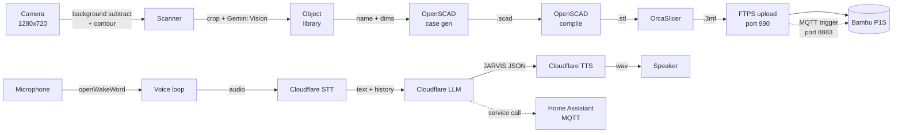
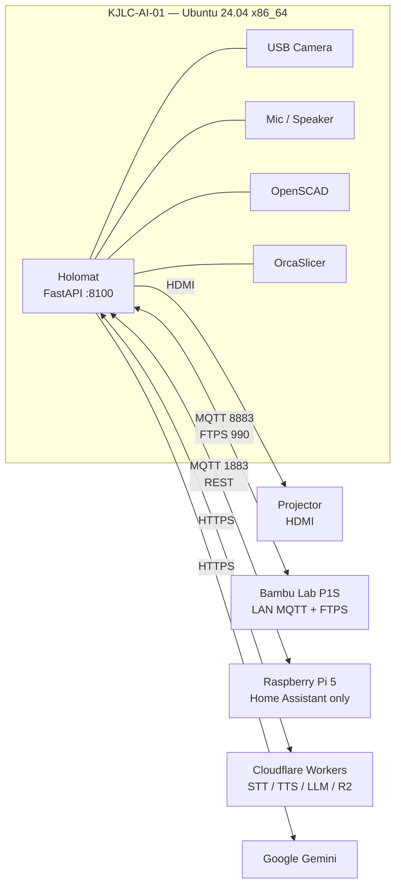

# Holomat

> A smart workshop mat. Drop a part on it, ask JARVIS to scan it, and Holomat
> identifies the object, generates a 3D-printable case for it, slices the model,
> and dispatches the print to a Bambu P1S — all from a touchscreen UI that also
> doubles as a voice assistant and a Home Assistant control panel.

| | |
|---|---|
| **Version**           | 1.0.0 |
| **Primary host**      | `KJLC-AI-01` (Ubuntu 24.04 x86_64) |
| **Backend**           | FastAPI + Python 3.11+ |
| **Frontend**          | React 18 + TypeScript + Vite + Tailwind |
| **3D printer**        | Bambu Lab P1S (LAN MQTT) |
| **AI provider**       | Google Gemini 2.5 Flash |
| **Voice protocol**    | Wyoming (Home Assistant Assist) |

---

## What it does



| Subsystem            | What you get                                                                        |
|---|---|
| **Scanner**          | Drop an object on the mat → background subtraction → Gemini Vision ID → 50-entry FIFO library with pin-protection. |
| **Case generator**   | Library entry → Gemini-generated parametric OpenSCAD → compiled STL stored to disk. |
| **Print queue**      | Slice (OrcaSlicer CLI) → FTPS upload → LAN MQTT trigger → poll printer until done. Per-job AMS slot picker. |
| **Voice bridge**     | "Hey Jarvis" wake word → Wyoming TCP servers HA can dial into → Cloudflare worker pipeline (STT / LLM / TTS) → optional HA service calls. |
| **Home Assistant**   | MQTT discovery bridge — Holomat appears as a device, exposes calibration/queue/voice state. |
| **Gallery**          | Samba share dropbox → HEIC→JPEG conversion → upload to Cloudflare R2. |
| **Settings UI**      | All credentials editable in-browser; written to `.env` on the server with restart-required banner. |

---

## Hardware topology



> **Important:** Holomat does **not** run on a Raspberry Pi. The Pi only runs
> Home Assistant; all CV, AI, slicing, and voice work happens on `KJLC-AI-01`.
> Performance estimates throughout the docs assume that host.

---

## Quick start

### Prerequisites on `KJLC-AI-01`

```bash
sudo apt install -y python3.11 python3.11-venv python3-pip nodejs npm \
                    libportaudio2 openscad samba ffmpeg
```

OrcaSlicer is installed from the AppImage release; set `ORCA_APPIMAGE` to its
path (headless servers should also set `ORCA_DISPLAY=:99` with Xvfb).

### Clone + install

```bash
git clone https://github.com/KJegen149/holomat-api.git ~/holomat-api
cd ~/holomat-api

python3.11 -m venv venv
venv/bin/pip install -r requirements.txt
venv/bin/pip install openwakeword --no-deps   # see requirements.txt note

cd ui && npm install && npm run build && cd ..
```

### Configure

Copy `.env.example` to `.env` and fill in credentials — or boot the server
and use the **Settings** tab in the UI, which writes the file for you.
See [CONFIG.md](CONFIG.md) for every env var the project reads.

Minimum to get past the boot checklist:

```env
GEMINI_API_KEY=...
BAMBU_SERIAL=...
BAMBU_IP=...
BAMBU_ACCESS_CODE=...
BAMBU_EMAIL=...           # required even on LAN — used to fetch user_id
BAMBU_PASSWORD=...
```

### Run

```bash
venv/bin/uvicorn main:app --host 0.0.0.0 --port 8100
```

Open <http://localhost:8100> for the JARVIS UI.

For a systemd service (recommended on the kiosk), see
[ARCHITECTURE.md § Deployment](ARCHITECTURE.md#deployment).

---

## Project layout

```
holomat-api/
├── main.py                 # FastAPI app, lifespan, router mounts
├── core/                   # Domain modules (camera, slicer, printer, voice...)
├── api/routes/             # FastAPI routers — one per feature
├── ui/                     # React/Vite SPA
│   ├── src/pages/          # One per tab (Dashboard, Scanner, Print, Voice...)
│   ├── src/hooks/          # use* hooks (state + polling for each tab)
│   └── src/components/     # Console, Layout, BootChecklist, ...
├── scripts/                # Standalone test/install helpers
├── certs/                  # printer.pem (Bambu FTPS X.509 cert — public)
├── scan_data/              # Runtime persistence (library, queue, STLs)
├── calibration_data/       # Camera intrinsics + homography
└── ha/                     # Home Assistant theme YAML
```

---

## Documentation

| Doc                                | What's in it                                                          |
|---|---|
| [ARCHITECTURE.md](ARCHITECTURE.md) | Module map, data flow, threading model, deployment, design decisions. |
| [CONFIG.md](CONFIG.md)             | Every env var: name, default, effect, required-or-optional.           |
| [CLAUDE.md](CLAUDE.md)             | Project context for AI assistants working in this repo.               |

---

## Tech stack

**Backend** — FastAPI · uvicorn · pydantic · OpenCV · NumPy · paho-mqtt ·
google-generativeai · bambulabs-api · wyoming · openWakeWord · sounddevice ·
watchdog · Pillow · pillow-heif · httpx

**Frontend** — React 18 · TypeScript · Vite · Tailwind CSS (`j-*` token namespace) ·
Lucide icons

**External services** — Bambu Cloud (auth only) · Bambu Printer (LAN MQTT + FTPS) ·
Home Assistant (MQTT + REST) · Cloudflare Workers (STT / TTS / LLM / R2) ·
Google Gemini · Meshy 3D

---

## Status & roadmap

Phase 10 (QA pass + 1.0 release) is complete. The print pipeline has been
verified end-to-end on firmware 01.08.00 with the printer in normal
cloud-connected mode (Bambu Handy and Bambu Studio continue to work alongside
Holomat — LAN-only mode is **not** required).

See `PHASE_11_ROADMAP.md` for what's planned next.
